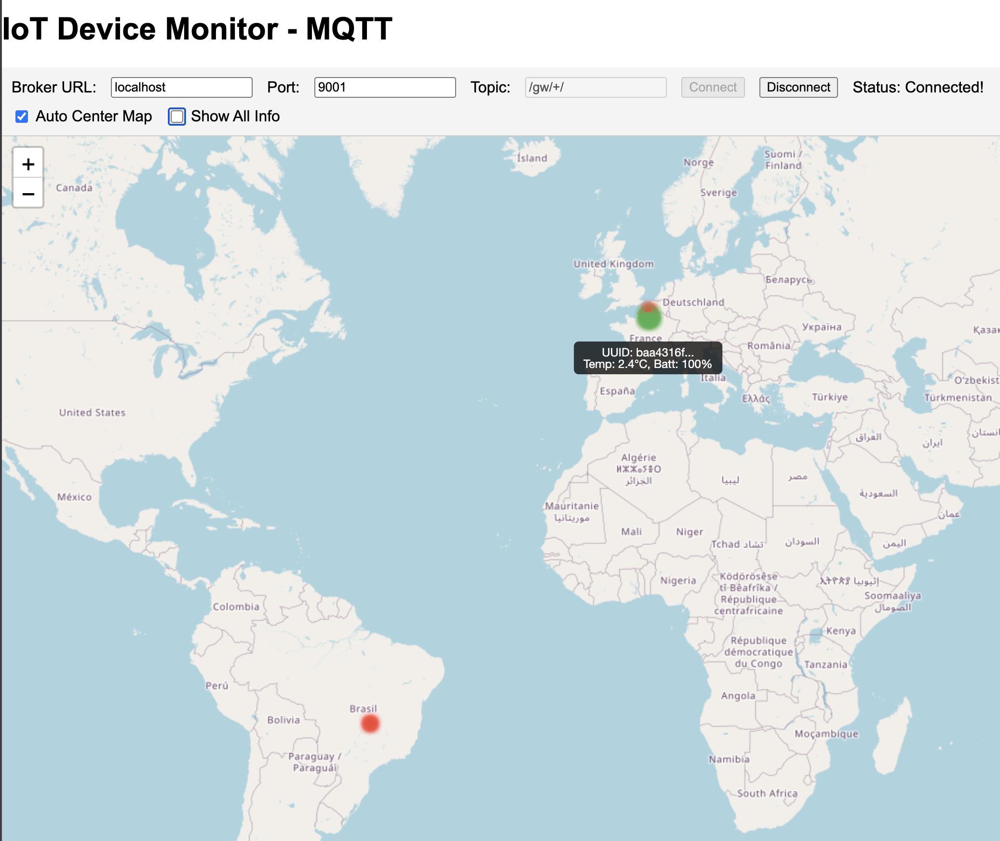

# IoT Simulator

This project is an IoT Simulator designed to mimic the behavior of various IoT devices for testing and development purposes.
It allows users to simulate data generation, device communication, and interaction with cloud services.

## Main features

- IoT devices implemented as CoAP servers
- Configurable behavior via JSON files (see examples in `scenarios/` folder)
  - Temperature values
  - Battery levels
  - Network latency
  - Drop rates
  - Coordinates
- Simulation of atypical behaviors or any event that changes the initial values (see `scenarios/event-model.json`)
  - Events can be transient or permanent
  - Received by device via CoAP POST requests

## TODO

- Orchestration of multiple devices:
  - Start/stop multiple device simulations
  - Manage sequence of events across devices
  - Aggregate data from multiple devices (MQTT?)

## Requirements

- Python 3.12+
- uv
- mosquitto (for MQTT broker)

## Usage

- Install `uv`:

  ```bash
  # with pip
  pip install uv

  # with homebrew (macOS)
  brew install uv
  ```

- Create and activate a virtual environment:

  ```bash
  uv venv --python 3.12
  uv pip install .
  ```

- Run the simulator with a scenario file:

  ```bash
  uv run iot-sim scenarios/device-model.json
  ```

- Run the client to interact with the simulated device:

  ```bash
  # GET request - fetch device data
  uv run iot-client coap://127.0.0.1:5001/device/data
  # POST request - send an event to the device
  uv run iot-client coap://127.0.0.1:5001/device/data scenarios/event-transient.json
  ```

## IoT Gateway

- A simple IoT Gateway is also provided to aggregate data from multiple devices.
- The reply from each device is published to an MQTT broker.

### Mosquitto Configuration

- To use all the resources of the simulation enable websockets in Mosquitto by adding the following lines to the `mosquitto.conf` file:

  ```conf
  # default listener
  listener 1883
  protocol mqtt

  # websocket listener
  listener 9001
  protocol websockets
  allow_anonymous true
  ```

### Running the Gateway

- Run the gateway with request interval, device list and topic prefix:

  ```bash
  uv run iot-gw -d scenarios/devices-01-50.json -i 5000 -t "/gw/001/"
  ```

- You can run as many gateways as you want, just change the topic prefix and the configuration file:

  ```bash
  uv run iot-gw -d scenarios/devices-02-50.json -i 5000 -t "/gw/002/"
  ```

## IoT MQTT monitor

- In folder `web` you will find a HTML page that can be used to monitor devices live information as they are published by the IoT gateways.
- Simple open the `index.html` file in a web browser and configure the MQTT broker connection parameters and the topic of interest (`/gw/+/`, for instance).
- Here is an screenshot of a scenario with 2 gateways and devices in Brazil and France.



## Scripts

The following scripts are available in the `scripts/` folder (run from the project root folder):

- `run-iot.sh`: Run the IoT simulator with from a specific folder.
  Files must follow a naming convention.
  See `scenarios/2x50/` for an example.

  ```bash
  # Usage: scripts/run-iot.sh <folder> <region> <device_id>
  ./scripts/run-iot.sh scenarios/2x50 1 1 # region 1, device 1
  ```

- `run-iot-range.sh`: Run a range of IoT simulators with from a specific folder.
  Files must follow a naming convention.
  See `scenarios/2x50/` for an example.

  ```bash
  # Usage: scripts/run-iot-range.sh <folder> <region> <device_id_start> <device_id_end>
  ./scripts/run-iot-range.sh scenarios/2x50 1 1 50 # region 1, devices from 1 to 50
  ```
